# Manual de Usuario

Cómo configurar y administrar las pruebas proyectivas y obtener el informe

---

## 1. Qué es PsiMatrix

PsiMatrix es una aplicación que se usa desde el navegador para administrar en pantalla cuatro pruebas proyectivas y armar un informe con lo que produjo la persona evaluada:

| Prueba | Qué hace el evaluado |
|---|---|
| **Test de la Casa** | Dibuja una casa o espacio habitable con lápiz, pincel, goma y color. |
| **Constelación Familiar / Vincular** | Ubica en un plano elementos que representan personas, vínculos, obstáculos y refugios. |
| **Dinámica Cromática** | Expresa un estado afectivo con trazos y manchas de color. |
| **Laberinto Estructural** | Traza un recorrido desde la entrada (verde) hasta la salida (roja). |

De cada prueba quedan la imagen final y el tiempo que llevó. Al final, el profesional agrega sus observaciones y descarga el informe en Word o PDF.

La aplicación tiene dos partes:

- **Configuración de la evaluación**: la usa el **evaluador** para decidir qué pruebas se toman, en qué orden y con qué condiciones.
- **Evaluación**: donde se registra al evaluado, se toman las pruebas y se arma el informe.

Funciona en computadora, tablet y celular, con mouse, dedo o lápiz. No hace falta usuario ni contraseña.

> **Privacidad:** los datos del evaluado y sus dibujos no se envían a ningún lado ni se guardan. Quedan solo en la pantalla mientras dure la evaluación. **Descargue el informe antes de cerrar la página.**

## 2. Antes de empezar: la configuración

Antes de la primera evaluación, el evaluador tiene que dejar una **configuración activa**. Si se abre la evaluación sin configuración, aparece **"No hay una configuración activa"** con el botón **"Ir a la configuración"**.

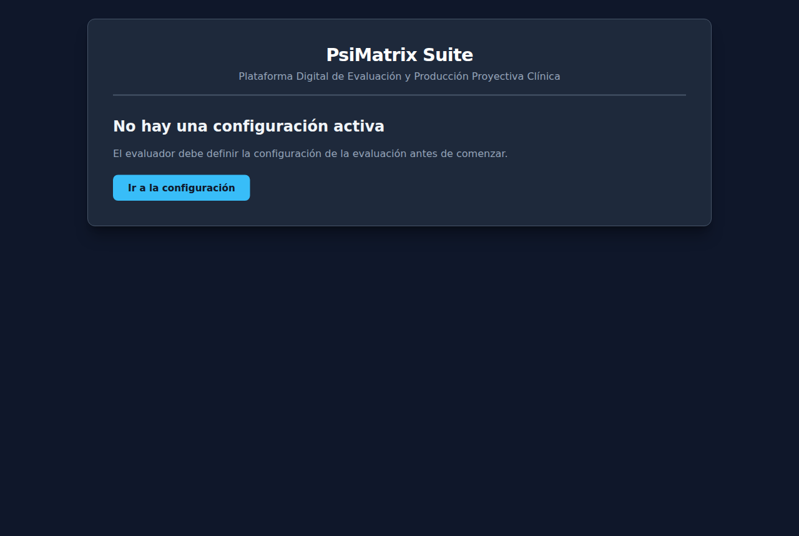

La configuración queda guardada en ese equipo y en ese navegador, aunque se cierre la página. Se usa para todos los evaluados hasta que el evaluador la cambie.

### 2.1 Abrir la configuración

Se llega a la pantalla **"Configuración de la Evaluación"** de dos maneras:

- con el botón **"Ir a la configuración"** cuando no hay configuración activa;
- con el botón **"Configuración (evaluador)"** de la pantalla *Registro del Evaluado* (ver la sección 3).

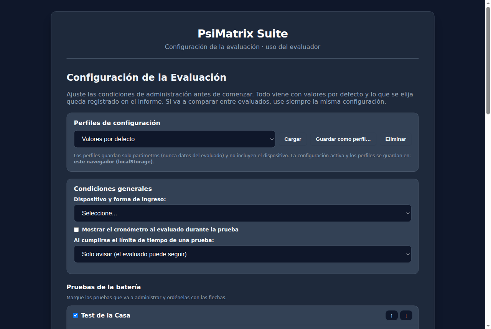

Todo viene con valores por defecto. Lo que se elija queda registrado en el informe.

### 2.2 Condiciones generales

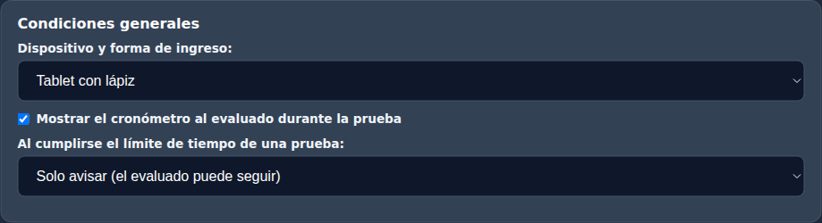

- **Dispositivo y forma de ingreso** (obligatorio): computadora con mouse, computadora con pantalla táctil, tablet con dedo, tablet con lápiz, celular con dedo u otro. Aparece en el informe, porque con el dedo el trazo es menos preciso que con lápiz o mouse.
- **Mostrar el cronómetro al evaluado durante la prueba**: si se marca, el evaluado ve el tiempo transcurrido o, si hay límite, el tiempo restante.
- **Al cumplirse el límite de tiempo de una prueba**:
  - *Solo avisar (el evaluado puede seguir)*: aparece el aviso "⏰ Se cumplió el tiempo límite" y la prueba sigue abierta.
  - *Guardar y cerrar la prueba*: se guarda lo realizado hasta ese momento y se vuelve al menú.

### 2.3 Pruebas de la batería

Cada prueba tiene su tarjeta. En todas:

- la casilla junto al nombre la **incluye o excluye** de la evaluación (tiene que quedar al menos una);
- las flechas **↑** y **↓** cambian el **orden** en que aparecen;
- **Consigna**: el texto que ve el evaluado arriba de la prueba. Se puede modificar. Si se deja vacío, no se muestra consigna;
- **Límite de tiempo** en minutos, de 0 a 240 (0 = sin límite).

**Test de la Casa**

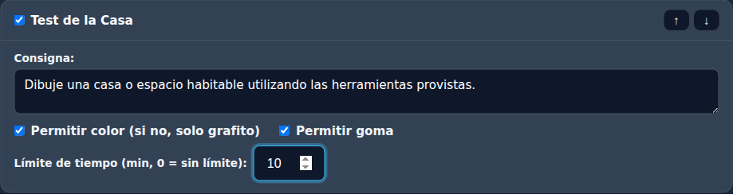

- **Permitir color**: si no se marca, se dibuja solo en gris grafito.
- **Permitir goma**: si no se marca, no aparece el botón Goma.

**Constelación Familiar / Vincular**

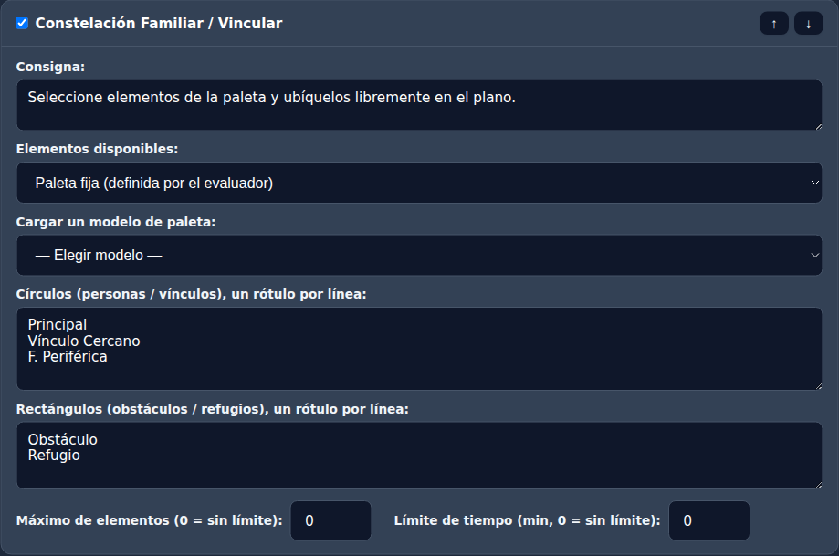

- **Elementos disponibles**:
  - *Paleta fija*: el evaluado elige entre elementos ya definidos. Se escriben en **Círculos (personas / vínculos)** y **Rectángulos (obstáculos / refugios)**, un rótulo por línea. Con **Cargar un modelo de paleta** se completan con un modelo listo (*Genérica*, *Familiar* o *Laboral*), que después se puede modificar.
  - *Rótulos que escribe el evaluado*: el evaluado agrega círculos y rectángulos y les pone el nombre que quiere.
- **Máximo de elementos** que se pueden poner en el plano (0 = sin límite).

**Dinámica Cromática**

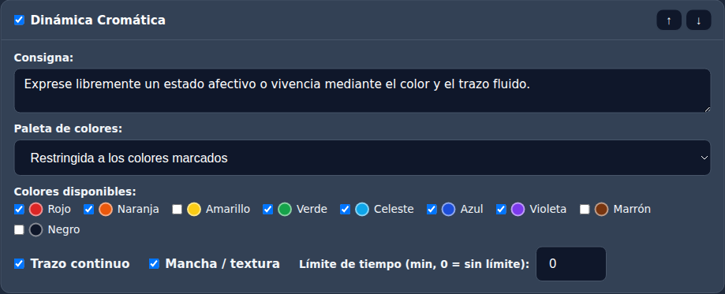

- **Paleta de colores**: *Libre* (cualquier color) o *Restringida a los colores marcados*, eligiendo los colores disponibles.
- **Herramientas**: *Trazo continuo* y/o *Mancha / textura* (al menos una).

**Laberinto Estructural**

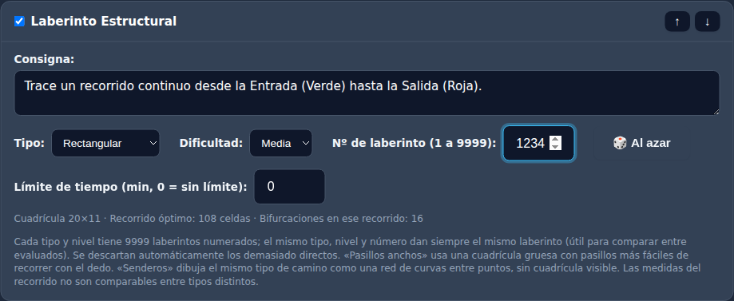

- **Tipo**:
  - *Rectangular*: paredes finas sobre una cuadrícula.
  - *Pasillos anchos*: pasillos blancos sobre fondo oscuro, más fáciles de recorrer con el dedo.
  - *Senderos*: caminos curvos entre puntos, sin cuadrícula visible.
- **Dificultad**: Fácil, Media o Difícil (cambia la cantidad de casilleros).
- **Nº de laberinto** (1 a 9999): el mismo tipo, dificultad y número dan siempre el mismo laberinto. Así se le puede dar el mismo laberinto a distintos evaluados. Con **🎲 Al azar**, o dejando el campo vacío, se elige uno cualquiera.
- Debajo se ve un resumen del laberinto elegido: tamaño, largo del recorrido más corto y cantidad de bifurcaciones.

### 2.4 Perfiles: guardar una configuración para reusarla

Un **perfil** es una configuración guardada con un nombre, por ejemplo "Adultos laborales" o "Adolescentes". Sirve para tomar siempre las pruebas en las mismas condiciones.

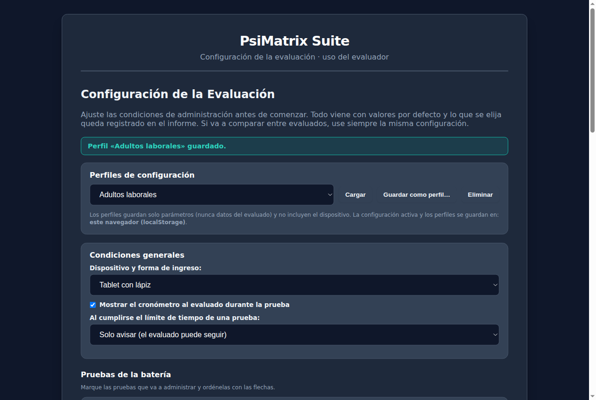

- **Guardar como perfil…**: pide un nombre y guarda la configuración del formulario. Si ya existe un perfil con ese nombre, pregunta si se reemplaza.
- **Cargar**: elegí el perfil en la lista y tocá *Cargar*. Se completa el formulario, pero **todavía falta aplicarlo** (ver 2.5). Con *Valores por defecto* se vuelve a la configuración inicial.
- **Eliminar**: borra el perfil elegido, después de confirmar.

Los perfiles guardan solo las condiciones de las pruebas, nunca datos de evaluados. Tampoco guardan el dispositivo, que se elige cada vez. Quedan guardados en ese equipo y navegador: en otra computadora no aparecen.

### 2.5 Aplicar la configuración

Al pie de la pantalla:

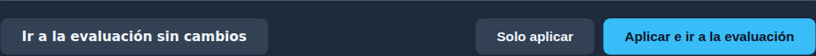

- **Aplicar e ir a la evaluación**: deja esta configuración como activa y abre la evaluación.
- **Solo aplicar**: la deja activa y se queda en la configuración.
- **Ir a la evaluación sin cambios**: vuelve a la evaluación sin modificar la configuración activa.

Si falta algo (por ejemplo, el dispositivo o al menos una prueba), aparece un mensaje que lo indica.

> Para poder comparar resultados entre evaluados, use siempre la misma configuración. Los perfiles ayudan a eso.

## 3. Registrar al evaluado

La evaluación empieza en **"Registro del Evaluado"**.

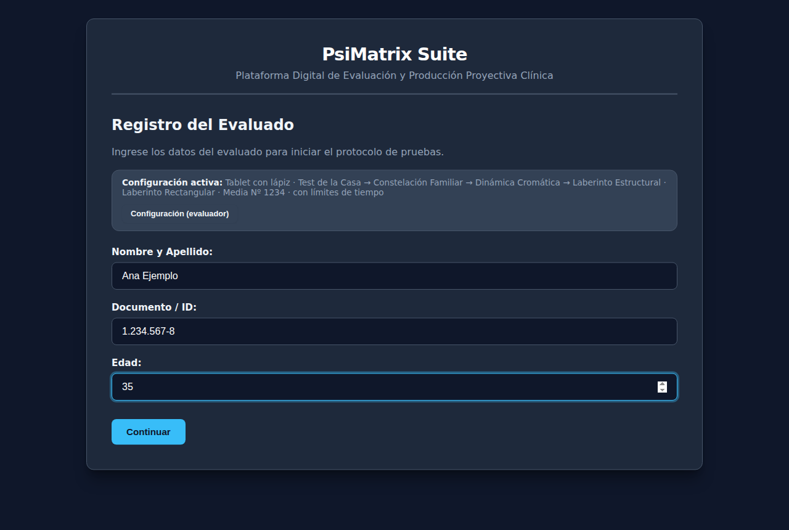

Arriba se ve un resumen de la **Configuración activa**: dispositivo, pruebas en orden, laberinto elegido y si hay límites de tiempo. Si hay que cambiar algo, tocá **"Configuración (evaluador)"**. Ese botón está solo en esta pantalla: durante las pruebas el evaluado no puede llegar a la configuración.

1. Escribí **Nombre y Apellido** (obligatorio).
2. Opcionalmente, **Documento / ID** y **Edad** (entre 0 y 120). Si se dejan vacíos, en el informe aparece "S/D".
3. Tocá **Continuar**.

## 4. Batería de pruebas

Se abre el menú **"Batería de Pruebas"**, con el nombre del evaluado arriba a la derecha. Se muestran solo las pruebas configuradas, en el orden elegido.

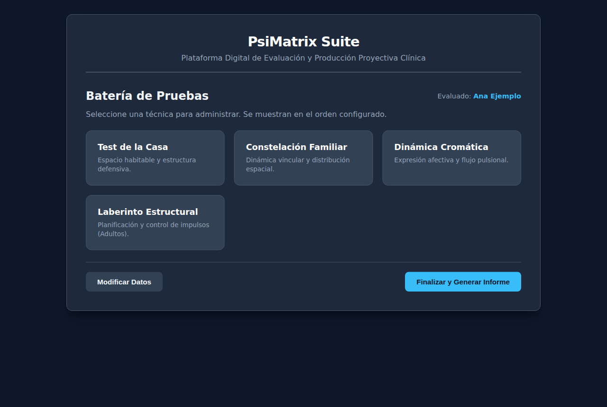

- Tocá una tarjeta para abrir esa prueba.
- Cuando una prueba se guarda, su tarjeta muestra **"✓ Completado"**.
- Una prueba guardada se puede **volver a abrir**: aparece con lo que ya se había hecho y el tiempo sigue sumando.
- **Modificar Datos** vuelve al registro para corregir nombre, documento o edad.
- **Finalizar y Generar Informe** arma el informe (sección 6).

### Al hacer cada prueba

Todas las pruebas tienen arriba la **consigna** y, si se configuró, el **cronómetro** ("⏱ Tiempo" o "⏱ Tiempo restante"). Abajo tienen dos botones:

- **Guardar y Continuar**: guarda la prueba y vuelve al menú. Esta versión es la que va al informe.
- **Regresar al Menú**: vuelve sin guardar. Si hubo cambios, pregunta antes; el informe usará la última versión guardada.

El tiempo de cada prueba se cuenta solo mientras está abierta.

## 5. Las pruebas

### 5.1 Test de la Casa

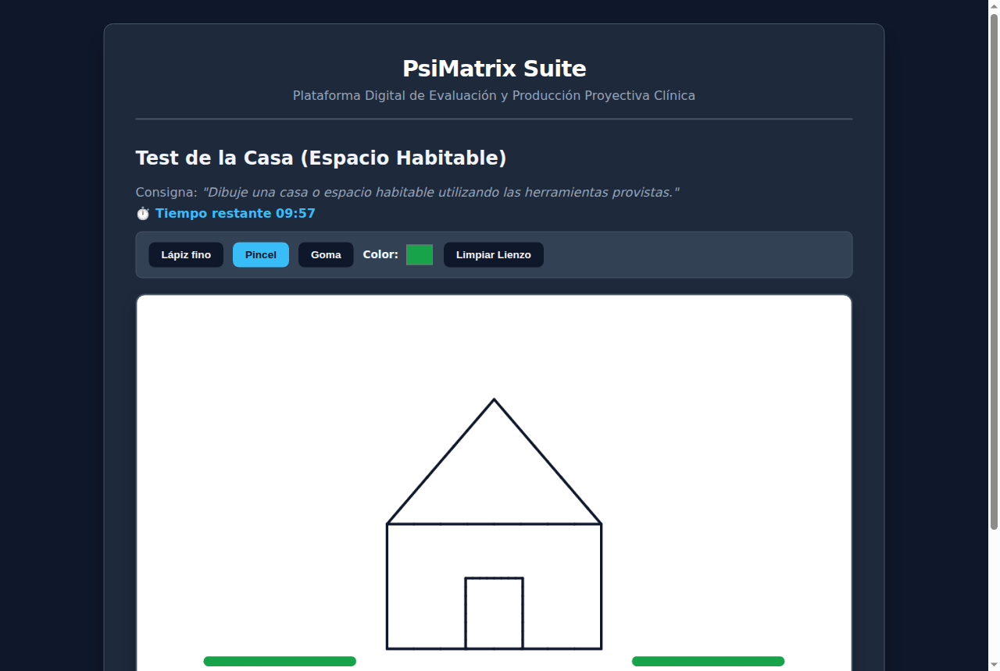

- **Lápiz fino**, **Pincel** (trazo grueso) y **Goma** (si está permitida).
- **Color**: abre un selector para elegir el color (si está permitido).
- **Limpiar Lienzo**: borra todo el dibujo, después de confirmar.

### 5.2 Constelación Familiar / Vincular

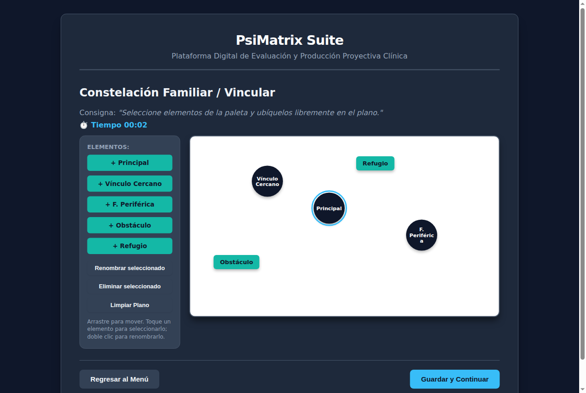

- En **Elementos**, tocá un botón (por ejemplo **"+ Principal"**) para agregarlo al plano. Si la paleta es libre, los botones son **"+ Círculo"** y **"+ Rectángulo"**, y se pide escribir el rótulo.
- **Arrastrá** los elementos para ubicarlos en el plano.
- Tocá un elemento para **seleccionarlo** (queda resaltado). Después:
  - **Renombrar seleccionado** (o doble clic sobre el elemento) cambia el rótulo;
  - **Eliminar seleccionado** (o la tecla Suprimir) lo quita.
- **Limpiar Plano** quita todos los elementos, después de confirmar.
- Si se configuró un máximo, al llegar avisa "Se alcanzó el máximo de elementos".

### 5.3 Dinámica Cromática

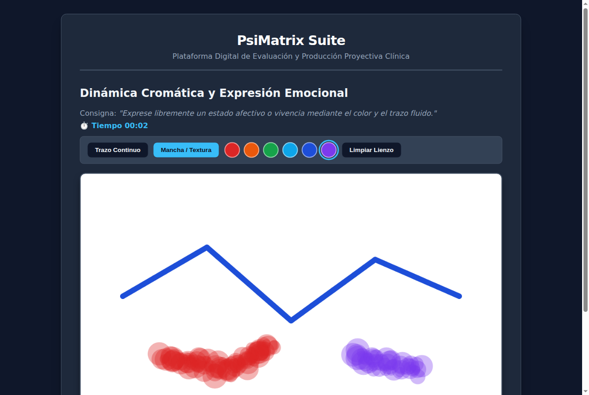

- **Trazo Continuo** dibuja una línea gruesa. **Mancha / Textura** pinta manchas difusas.
- El color se elige con el selector **Color** o, si la paleta está restringida, tocando uno de los círculos de color.
- **Limpiar Lienzo** borra todo, después de confirmar.

### 5.4 Laberinto Estructural

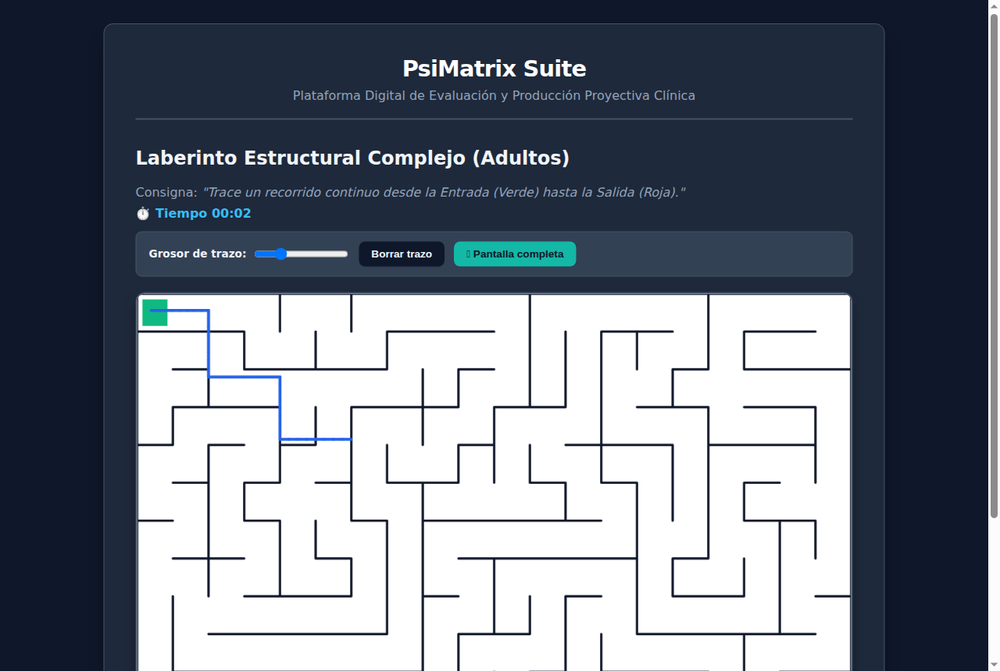

- El evaluado traza un recorrido desde el cuadrado **verde** (entrada) hasta el **rojo** (salida), sin levantar el dedo o el lápiz si es posible.
- **Grosor de trazo**: hace la línea más fina o más gruesa.
- **Borrar trazo**: borra lo trazado y se puede empezar de nuevo.
- **Pantalla completa**: agranda el laberinto para usar toda la pantalla, útil en tablet horizontal. Se sale con **"Salir de pantalla completa"** o con la tecla Esc.

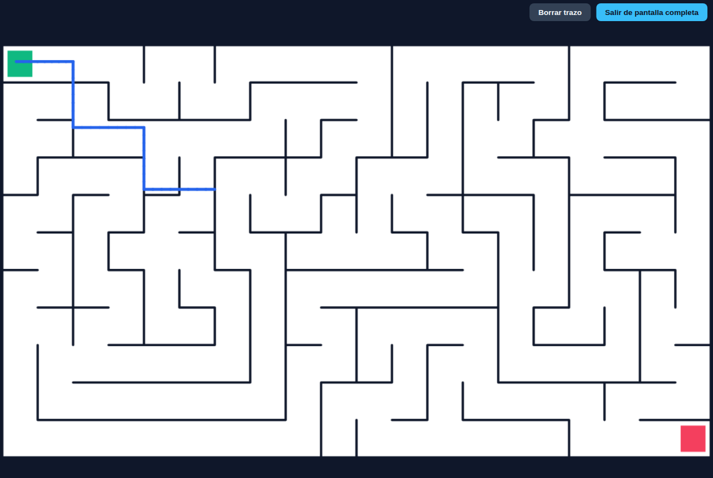

## 6. El informe

Cuando las pruebas están hechas, en el menú tocá **"Finalizar y Generar Informe"**.

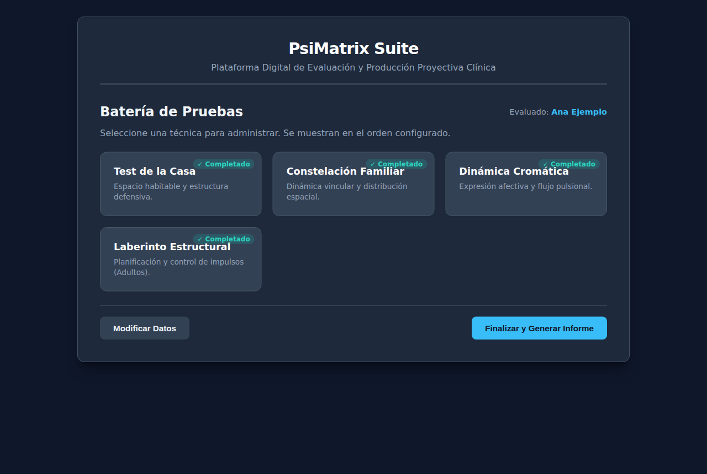

Si falta alguna prueba o quedaron cambios sin guardar, la aplicación lo avisa y pregunta si se genera el informe igual. Tiene que haber al menos una prueba guardada.

Se abre **"Protocolo e Informe Clínico Final"**:

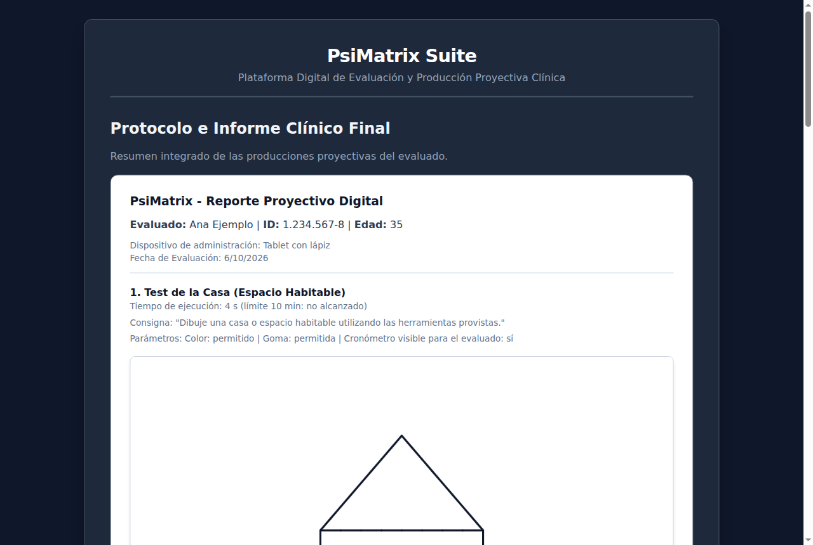

El informe incluye:

- datos del evaluado, dispositivo y fecha;
- por cada prueba: la imagen, el tiempo de ejecución (y si se alcanzó el límite), la consigna y las condiciones con que se tomó;
- en el laberinto, además: tipo, dificultad, número, largo del recorrido más corto y medidas del recorrido del evaluado (cuántos casilleros recorrió, si llegó a la salida y cuántas veces atravesó una pared o salió del camino).

Debajo de cada prueba hay un recuadro **"Observaciones del profesional"**, y al final uno de **"Observaciones generales"**. Lo que se escriba ahí sale en el informe impreso y en el Word.

> Las medidas del laberinto son descriptivas y pueden tener una diferencia de un casillero en las esquinas. Solo sirven para comparar evaluados que hicieron el mismo tipo, dificultad y número de laberinto.

## 7. Guardar el informe y seguir con otro evaluado

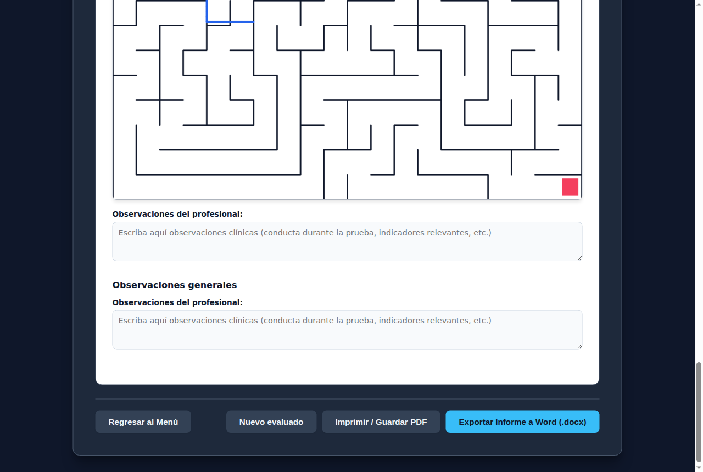

- **Exportar Informe a Word (.docx)**: descarga un archivo Word con todo el informe, imágenes incluidas. Necesita conexión a internet; si no hay, avisa y se puede usar la opción de PDF.
- **Imprimir / Guardar PDF**: abre la ventana de impresión del navegador. Para obtener un PDF, elegí "Guardar como PDF" como impresora.
- **Nuevo evaluado**: borra los datos y producciones del evaluado actual, después de confirmar, y vuelve al registro. La configuración se mantiene.
- **Regresar al Menú**: vuelve a la batería, por ejemplo para rehacer o agregar una prueba.

**Importante:** si se cierra o recarga la página, se pierde todo lo del evaluado. El navegador avisa antes de salir si hay datos, pero conviene **descargar siempre el informe** antes de cerrar.

## 8. Uso en tablet y celular

- Se puede dibujar con mouse, dedo o lápiz.
- Con el dedo el trazo es menos preciso, sobre todo en el laberinto. Por eso el dispositivo queda anotado en el informe.
- Se recomienda usar la tablet en **horizontal**.
- Para el laberinto con el dedo, conviene el tipo **Pasillos anchos** o **Senderos** y la **Pantalla completa**.

## 9. Preguntas frecuentes

| Situación | Qué hacer |
|---|---|
| Aparece "No hay una configuración activa" | Tocá *Ir a la configuración*, elegí el dispositivo y tocá *Aplicar e ir a la evaluación*. |
| No aparece una prueba en el menú | No está incluida en la configuración. Volvé a *Configuración (evaluador)* y marcala. |
| "Por favor ingrese al menos el nombre del evaluado" | Completá *Nombre y Apellido*. |
| No aparece la goma o el selector de color | La configuración no los permite. |
| Mis perfiles no aparecen | Los perfiles quedan en el equipo y navegador donde se crearon. |
| No se pudo exportar a Word | Revisá la conexión a internet o usá *Imprimir / Guardar PDF*. |
| Cerré la página por error | Lo del evaluado no se puede recuperar. La configuración sí se conserva. |

## 10. Alcance

- Las pruebas son **cualitativas**: no tienen puntajes ni baremos. El laberinto es de diseño propio y no equivale a instrumentos normativos como el de Porteus.
- Las condiciones de cada prueba las define el profesional. La aplicación no las ajusta sola según la edad.
- Cambiar las condiciones afecta la comparación entre evaluados.
- La interpretación de las producciones es responsabilidad del profesional.
